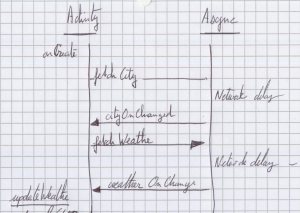
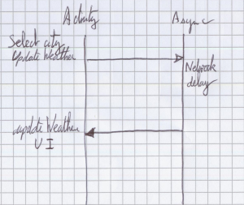
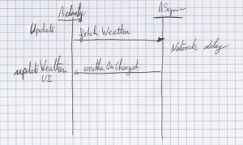

# weather-forecast
Weather forecast application

##Objet de l'application weather-forecast

Cette application présente le temps qu'il fait à l'utilisateur.

L'écran principal contient une icone réprésentant l'état du ciel.
A la suite de cette icone il y a la température puis l'état du ciel sous format texte enfin des
informations détaillées comme la pression , le vent et la date.

##Conception de l'application

L'application est basée sur une activité ( WeatherActivity )

Cette activité contient une toolbar permettant d'accèder à une menu pour pouvoir configurer la ville.
Le menu contient aussi une entrée pour actualiser les données.

Pour montrer à l'utilisateur que les données sont en cours de chargement un spinner est présenté
sur le haut de l'interface. Il s'efface en lorsque les données ont été récupérées.

Pour réagir aux événement lorsque des données ont été réci

###Données du programme

Les données du programmes sont :

####Les villes  : CityElement

Les villes contiennent :
 - le nom de la ville
 - la position géographique ( latitude , longitude )

Ces informations sont là pour permettre de requêter l'API soit sur le nom de la ville , soit sur les
coordonnées géographiques correspondantes.

Le programme actuel récupère une liste de ville au démarrage via une requête (données mocker). Cette liste serait à rendre dynamique ,
avec des options de recherche pour que l'utilisateur puisse avoir plus de possibilité. L'affichage
d'une telle liste serait à faire dans un fragment ou une activité dédiée.

Une fois la liste reçue cela déclenche cityListener.onChange , qui va ensuite à partir des information
sur la ville interroger l'API de meteo pour la ville concernée.

####Les informations météo (WeatherElement )

Les informations météo ( WeatherElement ) qui contiennent :
 - la ville
 - la date
 - l'état du ciel sous forme d'énumération ( SUN , CLOUD , RAIN , THUNDER , SNOW)
 - la température en °C
 - la pression en Pa
 - le vent en km/h
 - l'orientation du vent

L'utilisation d'un tel objet n'est pas très évolutif. Pour gérer de nouvelle proprité il faut étendre l'objet.

###Gestion des données

### Définition du store

Les données CityELement et WeathElement sont gérées par un store. C'est l'objet qui permet d'accèder aux
informations. Il peut réaliser les actions suivantes :
 - ajouter un élémenet( insert )
 - supprimer un élément (delete )
 - charger à partir d'un fichier les données  ( load) , non réalisé
 - sauver dans un fichier les données ( save )  , non réalisé
 - rechercher des données ( find )
 - récupérer des données (fetch)
 - alerter lorsque des nouvelles données ont été reçues par l'enregistrement d'une callback.

Les méthodes de bases sont définies dans la classe abstraite AStore.
WeatherStore et CityStore sont des spécialisations de AStore pour réaliser la méthode fetch.

L'implémentation actuelle conserve toutes les données enregistrées en mémoire ,
des méthodes sont présentes pour enregister et charger des données à partir de fichiers.
Etant donné le format des objet à charger , en ajoutant l'interface Serializable , on peut rapidement
avoir une sauvegarde et le chargement.

####Recherche de données
La méthode find prend en paramétre un objet dont la classe implémente l'interface IMatcher.
Cela permet d'éviter de développer à l'intérieur du store les différentes fonctions de recherche.
L'interface IMatcher contient une méthode match qui renvoie true ou false en fonction des tests réalisés
Les matchers pour les WeatherElement sont dans la classe WeatherElementMatchers.
Ce sont des fonctions simples pouvant être facilement testées unitairement.
En retour il y a un tableau vide , ou avec les éléments pour lesquels le matcher à renvoyé vrai.

####Récupération des données ( fetch )
Cette fonction prend en paramètre pour configure le requête à faire. Elle réalise de manière asynchrone la récupération des données.
Actuellement il s'agit d'un AsynTask dans laquelle il y a une pause de 5s et la génération de données
de météo aléatoires ( sauf la ville précisée en paramètre et la date qui augment de 1 jour pour chaque élément).

Les données reçues sont insérées dans le store à la réception.
Le fonctionnement actuel remplace l'ensemble des données du store lors d'un fetch.

Un objet AsyncTask ne bloque pas l'UI. Il est donc possible de changer de ville alors que les données sont en cours de chargement.
Lors de la mise à jour de l'UI aucun objet ne sera trouvé pour la ville sélectionnée. Un toast est donc affiché pour
indiquer qu'aucune donnée n'a été trouvée.

Si un listener a été enregistré (set)  alors celui est exécuté lorsque les données ont été recupérées.

##Evolution :

L'écran principal de présentation devrait être utilisée sous forme de fragment pour présenter la
météo des jours suivant.

La sélection des villes devrait utilisée une activité dédiée pour proposer une interface riche de sélection.
Recherche interactive....

Optimisation de la mémoire :
Le model actuel repose sur un stockage de l'ensemble des données en RAM. Leur volume étant a priori faible,
les prévisions n'allant pas au dela d'une dizaine de jour.
Si on souhaite mettre en place un historique et une gestion plus poussée il faudrait utiliser un ContentProvider.
Sur les villes cela permettrait d'avoir plus de possibilité à l'avenir.

Internationalisation :
Il faut pouvoir en fonction de la locale gérer les différences d'unité en fonction des pays.

Test:
A ajouter.

###Diagrammes

